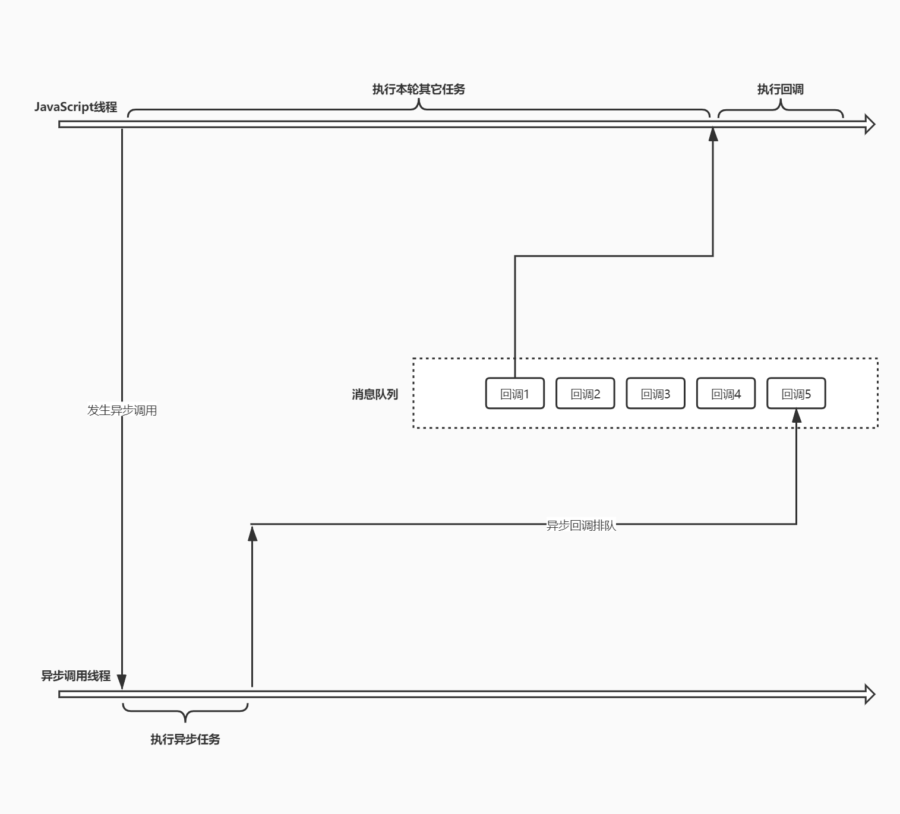

### JS 异步编程

#### 同步模式

不是同时执行，而是排队执行

```javascript
console.log('global begin')

function bar () {
  console.log('bar task')
}

function foo () {
  console.log('foo task')
  bar()
}

foo()

console.log('global end')

// 程序由上到下，依据执行次序，压入调用栈，输入如下
// global begin
// foo task
// bar task
// global end
```

缺点：JS 是单线程的，耗时操作容易造成阻塞


#### 异步模式

特点：不会等待这个任务的结束才开始下一个任务，开启过后就立即往后执行下一个任务，后溪逻辑一般会通过回调函数的方式定义

代码的执行顺序跳跃，显得很混乱

```javascript
console.log('global begin')

setTimeout(function timer1 () {
  console.log('timer1 invoke')
}, 1800)

setTimeout(function timer2 () {
  console.log('timer2 invoke')
  
  setTimeout(function inner () {
    console.log('inner invoke')
  }, 1000)
}, 1000)

console.log('global end')
```

event loop: 监听调用栈和消息队列，一旦调用栈中所有任务都结束了，就会从消息队列里取出第一个回调函数压入调用栈，执行之后，直到消息队列中的人物也都结束


明确一点：同步异步是指，运行环境提供的 API 是以同步或异步模式的方式工作 

##### 异步模型




#### Promise

```javascript
const promise = new Promise(function (resolve, reject) {
  // ...1
  resolve(100)
})

promise.then(function (value) {
  console.log('resolved', value)
}, function (error) {
  console.log('rejected', error)
})

console.log('end')

// 注意！即使 1 中没有任何异步代码，then方法中的回调函数还是会进入回调队列中排队
```

##### 使用案例

```javascript
// Promise 方式的 Ajax
function ajax (url) {
  return new Promise(function (resolve, reject) {
    var xhr = new XMLHttpRequest()
    xhr.open('GET', url)
    xhr.responseType = 'json'
    xhr.onload = function () {
      if (this.status === 200) {
        resolve(this.response)
      } else {
        reject(new Error(this.tatusText))
      }
    }
    xhr.send()
  })
}

ajax('/api/users.json').then(function (res) {
  console.log(res)
}, function (error) {
  console.log(error)
})
```

##### Promise 常见误区

连续串联多个异步执行任务，仍然出现回调函数嵌套？

回调地狱 => Promise 回调地狱

```javascript
ajax('/api/urls.json').then(function (urls) {
  ajax(urls.users).then(function (users) {
    ajax(urls.users).then(function (users) {
      ajax(urls.users).then(function (users) {
        ajax(urls.users).then(function (users) {
          
        })
      })
    })
  })
})
```

> 嵌套使用的方式是使用 Promise 最常见的错误
>
> 借助于 Promise then 方法链式调用的特点
>
> 尽可能保证异步任务扁平化

##### 链式调用

- Promise 对象的 then 方法会返回一个全新的 Promise 对象
- 后面的 then 方法就是在为上一个 then 返回的 Promise 注册回调
- 前面 then 方法中回调函数的返回值会作为后面 then 方法回调的参数
- 如果回调中返回的是 Promise，那后面 then 方法的回调会等待它的结束

##### 异常处理

```javascript
// 注意区分二者差异
// 只能捕获前一个 promise 抛出的异常
ajax('/api/users.json')
	.then(function onFulfilled (value) {
  	console.log('onFulfilled', value)
  	// return ajax('/error-url') // 这个异常就不会被捕获
	}, function onRejected (error) {
  	console.log('onRejected', error)
	})

// promise 链条上任何一个异常都会被向后传递直至被捕获
ajax('/api/user1.json')
	.then(function onFulfilled (value) {
  	console.log('onFulfilled', value)
	}) // 更像是为整个 Promise 链条注册失败回调
	.catch(function onRejected (error) {
  	console.log('onRejected', error)
	})

// 全局注册 unhandledrejection 事件回调，以捕获异常（遗漏、忘记捕获）
// 浏览器环境中
window.addEventListener('unhandledrejection', event => {
  const { reason, promise } = event
  
  console.log(reason, promise)
  // reason => Promise 失败原因，一般是一个错误对象
  // promise => 出现异常的 Promise 对象
  
  event.preventDefault()
}, false)

// 在 node 中
process.on('unhandledRejection', (reason, promise) => {
  console.log(reason, promise)
})
```

> 建议：在代码中明确捕获每一个可能的异常


##### Promise 静态方法

```javascript
Promise.resolve() // 快速转换为 promise 对象

Promise.resolve('foo')
	.then(function (value) {
  	console.log(value)
	})

// 如果 Promise.resolve() 接收到的参数是一个 promise，则会原样返回这个 promise
var promise = ajax('/api/users.json')
var promise2 = Promise.resolve(promise)
console.log(promise === promise2) // true

// 如果传入的是 “类 promise 对象”，实现 thenable 的接口
Promise.resolve({
  then: function (onFulfilled, onRejected) {
    onFulfilled('foo')
  }
}) // 为了兼容第三方 promise 对象
.then(function (value) {
  console.log(value)
})
// foo

Promise.reject() // 快速转换为失败的 promise 对象
// 传入的参数都会作为失败的原因
Promise.reject('anything')
	.catch(function (error) {
  	console.log(error)
	})
```


##### Promise 并行执行

```javascript
var promise = Promise.all([
  ajax('/api/users.json'),
  ajax('/api/posts.json')
])

promise.then(function (values) {
  console.log(values) // 全部成功
}).catch(function (error) {
  console.error(error) // 只要有一个失败
})

// 类似于 Promise 版本的 Array.prototype.every()

// 串并联
ajax('/api/urls.json') // 串行
	.then(value => {
  	const urls = Object.values(value)
    const tasks = urls.map(url => ajax(url))
    return Promise.all(tasks) // 并行
	})
	.then(values => {
  	console.log(values)
	})
	.catch(error => {
  	console.error(error)
	})

// Promise.race() 相当于 Promise 版本的 Array.prototype.some()
const request = ajax('/api/posts.json')
const timeout = new Promise((resolve, reject) => {
  setTimeout(() => reject(new Error('timeout')), 500)
})

Promise.race([
  request,
  timeout
])
.then(value => {
  console.log(value)
})
.catch(error => {
  console.log(error)
})
```


##### Promise 执行时序

即便 promise 中没有异步操作，then 函数的回调函数都会到回调队列中排队，必须等待当前同步代码执行完毕后才会执行回调函数

```javascript
console.log('global start')

Promise.resolve()
	.then(() => {
  	console.log('promise')
	})
	.then(() => {
  	console.log('promise 2')
	})

console.log('global end')

// global start
// global end
// promise
// promise 2

// -----------------------------
console.log('global start')

setTimeout(() => {
  console.log('setTimeout')
}, 0)

Promise.resolve()
	.then(() => {
  	console.log('promise')
	})
	.then(() => {
  	console.log('promise 2')
	})
	.then(() => {
  	console.log('promise 3')
	})

console.log('global end')

// global start
// global end
// promise
// promise 2
// promise 3
// setTimeout

// 解析
/*
回调队列中的任务称之为“宏任务”
宏任务执行过程中可以临时加上一些额外需求
这些临时的额外需求可以选择作为一个新的宏任务进到队列中排队
也可以作为当前任务的“微任务”，直接在当前任务结束过后直接执行
Promise 的回调会作为微任务执行

微任务，用以提高整体的响应能力

目前绝大多数异步调用都是作为宏任务执行
而 Promise & MutationObserver 以及 process.nextTick 都会作为微任务
*/
```

